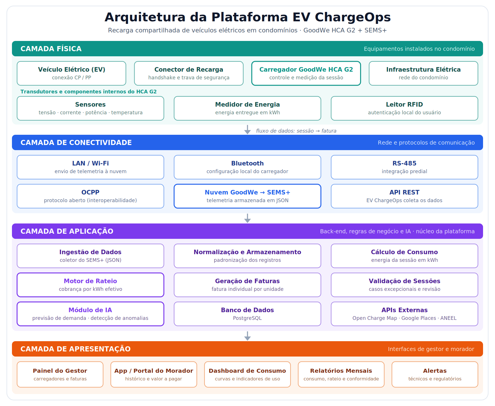

# Enterprise Challenge 2026 – FIAP & GoodWe

##  Integrantes e RMs
* Alexandre - RM: 572374
* Igor - RM: 573954
* Kaua - RM: 573734
* Laura - RM: 573954
* Pedro - RM: 573405

---

##  Frente 1 – Contexto e Problema

### 1.1 Infraestruturas de Recarga Compartilhada e Desafios Operacionais

Em função do aumento expressivo nos últimos anos de vendas de veículos elétricos, surgiu a necessidade de pontos de recarga compartilhada, onde estações de recarga são utilizadas por consumidores distintos. Essas estações são localizadas em locais com tráfego constante de pessoas e permanência dessas pessoas de forma a permitir o carregamento dos veículos, como por exemplo condomínios, edifícios corporativos e campus universitários.

A infraestrutura de recarga compartilhada é composta por todos os elementos necessários para que o carregamento veicular seja efetivo, compreendendo as áreas de engenharia civil, elétrica e de telecomunicações, contando com redes elétricas, dutos, cabeamento, painéis solares, inversores, carregadores, espaço físico, equipamentos de telecomunicação entre outros, ou seja, tudo que é necessário para o permitir o carregamento dos veículos elétricos (EVs).

Entretanto, para a implantação e operação efetiva desses pontos de recarga, surgem diversos desafios operacionais, dentre os quais podemos citar:

* **Gerenciamento de carga:** A maioria das edificações existentes não foram projetadas visando o uso de carregadores de EVs, por isso o uso simultâneo de carregadores juntamente com usos comuns da instalação pode ocasionar uma sobrecarga no sistema, com consequente desarmamento do disjuntor geral do local. A substituição física de transformadores ou cabos de entrada, somada ao aumento de carga da edificação (*retrofitting*) pode gerar altos investimentos que poderiam inviabilizar a instalação dos carregadores veiculares;
* **Rateio de uso e consumo de energia:** uma vez que a energia consumida pelo carregador veicular é fornecida pelo medidor da área comum da edificação, a ausência de um sistema de medição individualizada automática gera a divisão do consumo para todos do condomínio ou local, onerando as pessoas que não utilizam o carregador veicular;
* **Adequações elétrica e Corpo de Bombeiros:** muitas vezes as edificações não possuem a infraestrutura elétrica necessária para instalação das estações de recarga e/ou não possuem todos os atributos obrigatórios cobrados pelo Corpo de Bombeiros, o que gera a necessidade de adequação e que pode gerar altos custos para tal;
* **Gestão de uso das estações de recarga:** a ausência de sistemas de previsão de carga e alertas, assim como sistemas de penalização, pode levar ao uso de espaços sem utilização efetiva das estações de recarga, o que pode acarretar conflitos entre os usuários.

---

### 1.2 Recarga Veicular: Processos e Dados Gerados

Durante uma sessão de recarga veicular várias ações e procedimentos são executados, visando a segurança da recarga, transmissão e validação de dados e geração de informações com consequente recarga segura do veículo. Normalmente seguem os passos apresentados a seguir.

* **Conexão Física (Handshake):** O conector do cabo do carregador GoodWe HCA G2 é inserido no bocal do veículo elétrico. Neste instante, o pino de controle piloto (CP) e o pino de proximidade (PP) do conector estabelecem uma comunicação de baixa tensão com o veículo para validar que o acoplamento físico foi bem-sucedido e seguro.
* **Autenticação e Autorização:** O fluxo elétrico permanece bloqueado por segurança. O usuário realiza a autenticação local (aproximando um cartão/tag RFID no leitor do carregador) ou remota (via aplicativo mobile integrado). O sistema valida as credenciais do usuário na base de dados para autorizar o início do fornecimento de energia.
* **Parametrização e Negociação de Carga:** O carregador e o conversor interno do carro (On-Board Charger - OBC) trocam informações sobre os limites de corrente e tensão suportados por ambas as partes.
* **Alimentação Ativa (Transmissão de Potência):** Os contatores internos do carregador fecham o circuito elétrico, iniciando a transferência de Corrente Alternada (CA) para o veículo, que a converte internamente para Corrente Continua (CC) para abastecer as células da bateria.
* **Monitoramento Contínuo e Telemetria:** Durante todo o fornecimento de energia, os sensores de corrente, tensão e temperatura do *hardware* realizam leituras em tempo real, gerando pacotes de dados periódicos.
* **Encerramento da Sessão:** A sessão pode ser finalizada por três gatilhos: comando do usuário (via app ou nova aproximação do RFID), limite pré-estabelecido atingido (bateria 100% ou teto de consumo programado) ou por interrupção de segurança (anomalias elétricas, picos de calor ou comando de corte do gerenciamento dinâmico de carga). Os contatores abrem, cessando a energia, e a trava física do conector é liberada.

Essas recargas geram muitos dados que por sua vez podem ser compartilhados com vários *players* através de ferramentas/plataformas. No caso da GoodWe as informações são geradas no carregador HCA G2 e enviadas ao SEMS +, onde ficam armazenadas e podem ser consultadas. Os dados gerados podem ser divididos em tipos/etapas, conforme a seguir:

* **Dados Estruturados de Sessão:** Identificador Único da Sessão (SessionID), Identificador do Usuário/Unidade (UserID/UnitID), estampa de data e hora de início e término (Timestamp_Start / Timestamp_End) para cálculo de duração, e o volume total de energia entregue acumulado em quilowatt-hora (kWh).
* **Métricas de Telemetria Contínua:** Curva de potência instantânea demandada (kW), tensão (V), corrente (A) por fase da rede elétrica e temperatura interna do *hardware*.
* **Dados de Eventos e Status:** Logs de erros elétricos, interrupções inesperadas de conectividade e alertas de segurança.

Todos esses dados são captados pelos transdutores internos do carregador GoodWe HCA G2. O *hardware* utiliza sua conectividade local (LAN ou Wi-Fi) para transmitir os pacotes via internet para o servidor em nuvem da GoodWe e que por sua vez podem ser acessados na plataforma SEMS+.

---

### 1.3 Modelos de Negócio para a Recarga Compartilhada

O Brasil e o cenário mundial compartilham basicamente os mesmos principais modelos de negócio para os sistemas de recarga compartilhada, estes são cinco, conforme apresentado a seguir:

1. **Recarga Gratuita (Subsídio Total):** O custo da energia consumida pelos veículos é absorvido integralmente pela administração do local (pago pela conta global de manutenção ou taxa condominial comum). É muito comum em hotéis, shopping centers e campus universitários como atrativo de marketing ou benefício institucional.
2. **Cobrança por Consumo Efetivo (por kWh):** O usuário paga estritamente pelo volume de energia elétrica (em quilowatt-hora) que foi injetado na bateria do seu veículo durante a sessão. Considerado o modelo mais justo pelo mercado, sendo o padrão adotado por grandes Operadoras de Pontos de Recarga (CPOs) em estacionamentos comerciais.
3. **Cobrança por Tempo de Ocupação (por Minuto/Hora):** A tarifação é baseada no tempo em que o veículo permanece conectado à estação de recarga, independentemente da quantidade de energia transferida. É muito utilizado para coibir o problema da ociosidade (vagas bloqueadas por carros já 100% carregados).
4. **Assinatura Mensal (Flat Fee / Tarifação Fixa):** O usuário paga uma mensalidade fixa para a administração ou para a operadora do *software* para ter direito de uso ilimitado (ou franquia de kWh) das estações compartilhadas. Funciona bem em frotas corporativas urbanas.
5. **Rateio Condominial Interno:** A despesa total de energia dos carregadores do mês é somada e dividida entre o grupo fechado de moradores que se declararam usuários e proprietários de EVs. Modelo analógico que gera distorções internas se um morador rodar muito mais do que outro.

Esses modelos de negócio ilustram o modo de cobrança ao consumidor final, mas em uma escala maior, existem outros modelos de negócio, especificamente para a aquisição e instalação dessas estações de recarga.

Enquanto os proprietários dos condomínios, edifícios corporativos e campos universitários podem fazer o estudo, projeto, executar a infraestrutura e por fim, adquirirem os carregadores e aplicarem os modelos de negócio informados anteriormente para cobrança, empresas como a Vaga55 Eletropostos e Sempre Energia diversificam esse nicho assumindo a responsabilidade desde o estudo até a instalação e testes do eletroposto e, sem que seja necessário nenhum investimento do contratante. Essas empresas fazem todo o serviço e cobram taxas mensais dos utilizadores, facilitando assim a instalação das estações de recarga e gerando maior confiança nos contratantes, visto que eles são os responsáveis pela manutenção das estações.

---

### 1.4 Análise de Mercado (Aprofundamento — Opção A)

Para fundamentar o desenvolvimento do EV ChargeOps, mapeamos três soluções consolidadas no mercado global e nacional de recarga compartilhada, identificando suas principais funcionalidades, modelos de negócios e limitações:

| Solução | Problema que Resolve | Funcionalidades Principais | Modelo de Negócio | Limitações Conhecidas |
| :--- | :--- | :--- | :--- | :--- |
| **Zaptec** (Pro/Go) | Gestão de recarga inteligente de alta escala para condomínios e frotas. | Balanceamento dinâmico de carga entre fases; controle de acesso via RFID/App; travas de segurança mecânicas no cabo. | Venda do hardware associada a licença de software de gestão para administradoras. | Custo de aquisição elevado por ser um produto importado (Noruega); dependência severa de conectividade contínua. |
| **Wallbox** (Pulsar Plus) | Recarga residencial e comercial compacta com foco em gerenciamento local. | Conectividade Bluetooth e Wi-Fi; tecnologia *Power Boost* (ajuste de potência local); integração com inversores solares. | Venda direta do equipamento físico; recursos básicos gratuitos no app e funções premium pagas. | Alcance limitado do gerenciamento de múltiplos carregadores simultâneos se o sinal Wi-Fi oscilar na garagem. |
| **ChargePoint** (Commercial) | Infraestrutura macro e micro de carregamento em rede para empresas e frotas. | Integration profunda em nuvem; mapas de localização globais; relatórios de pegada de carbono; lista de espera virtual. | Plataforma baseada em nuvem (*Software as a Service - SaaS*), cobrando assinaturas dos gestores e taxas por recarga dos motoristas. | Foco muito voltado ao mercado norte-americano; interface e suporte em português ainda limitados. |

---

#  Frente 2 – Base Regulatória e Técnica

## 2.1 Normas e Regulamentações
A Resolução Normativa ANEEL nº 1.000/2021 trouxe regras claras para a exploração comercial da recarga de veículos elétricos. Entre os pontos principais estão:
- A necessidade de comunicação prévia à distribuidora local quando houver cobrança pelo serviço.
- A obrigatoriedade de protocolos abertos de comunicação, como o OCPP, para garantir interoperabilidade entre equipamentos.
- A responsabilidade de manter segurança elétrica e transparência no consumo.

No caso de São Paulo, há exigências adicionais do Corpo de Bombeiros para estacionamentos com carregadores, incluindo sistemas de proteção contra incêndio. Além disso, normas municipais reforçam a importância da medição individualizada para evitar conflitos entre moradores.

**Proposta da equipe:** criar um **Checklist Regulatório Inteligente** dentro da plataforma EV ChargeOps. Esse recurso permitiria:
- Conferir automaticamente se o carregador utiliza protocolo aberto.
- Emitir alertas caso a comunicação com a distribuidora não tenha sido registrada.
- Gerar relatórios mensais de conformidade para gestores.

---

## 2.2 Carregador GoodWe HCA G2
O modelo HCA G2 instalado no Energy Lab possui diversas interfaces:
- RS-485: integração com sistemas prediais.
- LAN/Wi-Fi: envio de dados para a nuvem SEMS+.
- Bluetooth: configuração inicial local.
- RFID: autenticação de usuários.

**Proposta da equipe:** implementar um fluxo híbrido de autenticação, combinando RFID e aplicativo móvel. Isso aumenta a segurança e reduz riscos de uso indevido.

---

## 2.3 API GoodWe SEMS+
O acesso ao SEMS+ permite visualizar dados reais de operação, como:
- Status do carregador (online/offline).
- Potência instantânea (kW).
- Energia entregue por sessão (kWh).
- Eventos de início, fim e erros.

**Pipeline de dados sugerido:**
1. Coleta de dados via SEMS+ em formato JSON.
2. Normalização e armazenamento em banco de dados próprio.
3. Dashboards para gestores e usuários.
4. Relatórios automáticos de consumo e rateio.

### Exemplo de dados coletados (simulação)
| SessionID | UserID |  Início   |     Fim     | Duração | Energia (kWh) |    Status    |
|-----------|--------|-----------|-------------|---------|---------------|--------------|
| S001      | U101   | 21/06 10h | 21/06 11h   | 1h      | 7.2           | Concluída    |
| S002      | U102   | 21/06 11h | 21/06 11h30 | 30min   | 3.5           | Concluída    |
| S003      | U103   | 21/06 12h | 21/06 12h20 | 20min   | 2.1           | Interrompida |

---

## 2.4 APIs Complementares
Para enriquecer a solução, foram estudadas APIs externas:
- **Open Charge Map API:** fornece localização de pontos de recarga.
- **Google Places API (evChargeOptions):** traz contexto geográfico e perfil de uso.
- **ANEEL Open Data:** disponibiliza dados oficiais de infraestrutura elétrica.

**Integração proposta:** cruzar dados do SEMS+ com Open Charge Map para comparar consumo do condomínio com a média nacional, gerando relatórios inéditos para gestores.

---

## 2.5 Inovação Proposta
1. **Dashboard Regulatório Inteligente:** garante conformidade com normas e gera alertas automáticos.
2. **Pipeline de Dados Real:** organiza informações do SEMS+ em relatórios claros e acessíveis.
3. **Integração com APIs Externas:** amplia a visão dos gestores com dados nacionais e geográficos.
4. **Automação de Alertas:** notifica imediatamente em caso de falhas técnicas ou regulatórias.

---

# EV ChargeOps — Frente 3: Arquitetura e IA

## Visão Geral

O **EV ChargeOps** é uma plataforma para gestão de recargas compartilhadas de veículos elétricos em condomínios, utilizando como base o carregador **GoodWe HCA G2**, a integração com o **SEMS+**, autenticação por **RFID/aplicativo**, coleta de dados de consumo e geração de faturas individuais.

A solução tem como objetivo resolver problemas como:

- Controle individual do consumo de energia;
- Rateio justo entre moradores;
- Monitoramento das sessões de recarga;
- Alertas técnicos e regulatórios;
- Apoio por Inteligência Artificial na previsão de demanda e detecção de anomalias.

---

## Diagrama de Arquitetura

A figura abaixo resume a arquitetura completa do EV ChargeOps, organizada em quatro camadas (física, conectividade, aplicação e apresentação) e mostrando o fluxo de dados que parte da sessão de recarga e termina na fatura individual do morador.



> O dado nasce no carregador GoodWe HCA G2 (camada física), é transportado pela camada de conectividade até o **SEMS+**, é coletado e tratado pelo back-end na camada de aplicação (onde também atuam o motor de rateio e os modelos de IA) e, por fim, é exibido para gestores e moradores na camada de apresentação. As seções seguintes detalham cada uma dessas camadas.

## 1. Camadas da Plataforma

A arquitetura da plataforma EV ChargeOps é dividida em quatro camadas principais.

---

## 1.1 Camada Física

A camada física representa os equipamentos instalados no condomínio.

**Componentes principais:**

- Carregador GoodWe HCA G2;
- Conector de recarga;
- Medidor de energia;
- Sensores de tensão, corrente, potência e temperatura;
- Leitor RFID;
- Infraestrutura elétrica do condomínio.

Essa camada é responsável pela conexão com o veículo, autenticação inicial e coleta dos dados da recarga.

---

## 1.2 Camada de Conectividade

A camada de conectividade envia os dados do carregador para os sistemas digitais.

**Tecnologias utilizadas ou propostas:**

- LAN/Wi-Fi;
- Bluetooth para configuração local;
- RS-485 para integração predial;
- OCPP para comunicação aberta;
- API GoodWe SEMS+;
- API REST para comunicação com o sistema EV ChargeOps.

O carregador envia dados operacionais para o **SEMS+**, e a plataforma EV ChargeOps coleta essas informações para tratamento, armazenamento e geração de relatórios.

---

## 1.3 Camada de Aplicação

A camada de aplicação é o núcleo da plataforma. Nela ficam o back-end, banco de dados, regras de negócio, cálculo de rateio e módulos de IA.

**Principais funções:**

- Cadastro de usuários, unidades e veículos;
- Registro das sessões de recarga;
- Coleta dos dados vindos do SEMS+;
- Cálculo do consumo em kWh;
- Geração da fatura individual;
- Validação de sessões interrompidas;
- Alertas de falha;
- Previsão de consumo com IA;
- Detecção de anomalias.

---

## 1.4 Camada de Apresentação

A camada de apresentação é formada pelas interfaces usadas pelos moradores e gestores.

**Interfaces propostas:**

- Painel do gestor;
- Portal ou aplicativo do morador;
- Dashboard de consumo;
- Relatórios mensais;
- Alertas técnicos e regulatórios.

O gestor acompanha carregadores, consumo, falhas e faturas. O morador consulta seu histórico de recargas, consumo mensal e valor a pagar.

---

## 2. Fluxo de Dados

O fluxo de dados começa na sessão de recarga e termina na fatura do usuário.

### Caminho dos dados

1. O usuário conecta o veículo ao carregador GoodWe HCA G2;
2. O carregador realiza a validação física da conexão;
3. O usuário se autentica por RFID ou aplicativo;
4. O sistema valida usuário, veículo e unidade;
5. A sessão de recarga é iniciada;
6. O carregador coleta dados de consumo, potência, tensão, corrente e temperatura;
7. Os dados são enviados ao SEMS+;
8. O EV ChargeOps coleta os dados em formato JSON;
9. O sistema normaliza e armazena as informações;
10. O consumo da sessão é calculado em kWh;
11. As sessões do mês são agrupadas por unidade;
12. O modelo de rateio é aplicado;
13. A fatura individual é gerada.

---

## 3. Transformação dos Dados

| Dado coletado        | Transformação                    | Resultado                        |
| -------------------- | -------------------------------- | -------------------------------- |
| SessionID            | Associação com usuário e unidade | Identificação da sessão          |
| UserID / UnitID      | Validação no banco               | Morador responsável              |
| Início e fim         | Cálculo da duração               | Tempo total da recarga           |
| Energia entregue     | Padronização em kWh              | Consumo da sessão                |
| Potência instantânea | Análise de comportamento         | Curva de uso                     |
| Eventos e erros      | Classificação                    | Alerta ou revisão                |
| Status da sessão     | Validação                        | Sessão concluída ou interrompida |

---

## 4. Onde a IA Entra

A Inteligência Artificial entra como apoio à operação da plataforma. Ela não substitui a medição real do carregador, mas ajuda na análise dos dados.

A IA será usada principalmente para:

- Prever horários de maior demanda;
- Apoiar o gerenciamento de carga;
- Identificar sessões fora do padrão;
- Detectar falhas recorrentes;
- Ajudar o gestor a revisar casos suspeitos antes da fatura.

---

## 5. Modelo de Rateio

O modelo proposto é a **cobrança por consumo efetivo em kWh**.

Esse modelo foi escolhido porque é o mais justo para condomínios, já que cada unidade paga apenas pelo que realmente consumiu.

---

## 5.1 Variáveis Utilizadas

| Variável      | Descrição                         |
| ------------- | --------------------------------- |
| `SessionID`   | Identificação da sessão           |
| `UserID`      | Identificação do usuário          |
| `UnitID`      | Identificação da unidade          |
| `kWh_sessao`  | Energia consumida em uma sessão   |
| `kWh_unidade` | Soma do consumo mensal da unidade |
| `tarifa_kWh`  | Valor cobrado por kWh             |
| `taxa_fixa`   | Taxa opcional de manutenção       |
| `valor_final` | Valor total da fatura             |

---

## 5.2 Fórmula da Fatura

```text
kWh_unidade = soma de todas as sessões da unidade no mês
```

```text
valor_consumo = kWh_unidade × tarifa_kWh
```

```text
valor_final = valor_consumo + taxa_fixa
```

### Exemplo

```text
Unidade: Apto 302
Consumo mensal: 60 kWh
Tarifa: R$ 1,05/kWh
Taxa fixa: R$ 20,00

valor_consumo = 60 × 1,05
valor_consumo = R$ 63,00

valor_final = 63,00 + 20,00
valor_final = R$ 83,00
```

---

## 6. Casos Excepcionais

### Sessão interrompida

Se a sessão for interrompida por falha técnica, queda de conexão ou parada de segurança, o sistema utilizará a última medição válida.

```text
consumo_cobrado = última leitura válida - leitura inicial
```

Caso os dados estejam incompletos, a sessão ficará marcada como **pendente de revisão** no painel do gestor.

---

### Usuário que não carregou no mês

Se uma unidade não realizou nenhuma recarga no mês, ela não terá cobrança variável.

```text
kWh_unidade = 0
valor_consumo = R$ 0,00
```

Se o condomínio aprovar uma taxa fixa de manutenção, essa taxa poderá ser cobrada separadamente.

---

### Dois veículos da mesma unidade

Se uma unidade possuir dois veículos cadastrados, os consumos serão somados na mesma fatura.

| Unidade  | Veículo   | Consumo |
| -------- | --------- | ------: |
| Apto 302 | Veículo 1 |  35 kWh |
| Apto 302 | Veículo 2 |  25 kWh |
| Total    | —         |  60 kWh |

---

## 7. Aprofundamento — Papel da IA

A opção escolhida para aprofundamento foi a **Opção B: Definição do papel da IA**.

---

## 7.1 Previsão de Consumo

A IA pode analisar o histórico das sessões para prever horários de maior uso dos carregadores.

**Problema resolvido:**  
Evita sobrecarga elétrica e melhora o planejamento do uso dos carregadores.

**Técnicas possíveis:**

- Regressão Linear;
- Random Forest;
- Modelos de séries temporais.

**Dados necessários:**

- Histórico de sessões;
- Horário de início e fim;
- Consumo em kWh;
- Dia da semana;
- Carregador utilizado;
- Unidade responsável.

**Impacto esperado:**

- Melhor previsão de horários de pico;
- Apoio ao gerenciamento de carga;
- Redução de conflitos entre usuários;
- Planejamento de expansão da infraestrutura.

---

## 7.2 Detecção de Anomalias

A IA também pode identificar sessões com comportamento fora do padrão.

**Problema resolvido:**  
Evita cobranças incorretas e ajuda a identificar falhas técnicas.

**Técnicas possíveis:**

- Z-score;
- IQR;
- Isolation Forest;
- Regras estatísticas.

**Exemplos de anomalias:**

- Consumo muito alto em pouco tempo;
- Sessão com duração muito curta;
- Medição negativa ou incompatível;
- Sessão interrompida várias vezes;
- Falhas recorrentes no mesmo carregador;
- Consumo muito acima do histórico da unidade.

**Impacto esperado:**

- Mais segurança na cobrança;
- Menos erros no rateio;
- Alertas automáticos para o gestor;
- Maior transparência para os moradores.

---

## 8. Tecnologias Sugeridas

| Camada         | Tecnologias                               |
| -------------- | ----------------------------------------- |
| Física         | GoodWe HCA G2, RFID, sensores internos    |
| Conectividade  | LAN/Wi-Fi, Bluetooth, RS-485, OCPP        |
| Integração     | GoodWe SEMS+, API REST                    |
| Back-end       | Java Spring Boot ou Node.js               |
| Banco de dados | PostgreSQL                                |
| IA             | Python, Pandas, Scikit-learn              |
| Front-end      | React ou aplicação web responsiva         |
| Dashboard      | Gráficos de consumo, alertas e relatórios |

---

## 9. Fontes e Bases de Dados

- GoodWe SEMS+;
- ANEEL Open Data;
- Open Charge Map API;
- Google Places API;
- IBGE;
- PlugShare;
- Kaggle — Electric Vehicle Charging Sessions;
- UCI Machine Learning Repository.

---

## 10. Plano para a Sprint 02

A Sprint 02 (prazo: 20/09/2026) é a etapa de **desenvolvimento e prototipação**. O objetivo é transformar a arquitetura documentada nas Frentes 1, 2 e 3 em um protótipo funcional do EV ChargeOps, capaz de receber dados de sessões de recarga, calcular o rateio por kWh, gerar faturas individuais e aplicar os modelos de IA de previsão e detecção de anomalias.

Como o acesso ao SEMS+ em produção pode não estar disponível para todos os testes, o desenvolvimento será feito de forma a funcionar tanto com **dados reais do SEMS+** quanto com **dados simulados** (JSON no mesmo formato e dataset público de sessões de recarga do Kaggle). Isso garante que o protótipo seja demonstrável no vídeo pitch independentemente da disponibilidade do carregador físico.

### 10.1 Ordem de Desenvolvimento (Etapas)

O desenvolvimento segue a ordem das camadas, das fundações até as interfaces, respeitando as dependências entre os módulos.

**Etapa 1 — Fundação do projeto e modelo de dados**

- Configuração do repositório, ambiente e organização do back-end;
- Modelagem e criação do banco de dados (entidades **Usuário**, **Unidade**, **Veículo**, **Sessão** e **Fatura**, com seus relacionamentos);
- Criação de registros simulados para teste.
- _Tecnologias:_ PostgreSQL, Spring Boot (ou Node.js), Docker.
- _Entregável:_ schema do banco criado e populado com dados de exemplo.

**Etapa 2 — Ingestão e normalização dos dados**

- Coletor que lê os dados de sessão no formato JSON do SEMS+;
- Camada de simulação que injeta dados de teste no mesmo formato (dataset Kaggle + JSON sintético);
- Normalização e gravação das sessões no banco.
- _Tecnologias:_ API REST, integração SEMS+, Python/Pandas para tratamento do dataset.
- _Entregável:_ sessões normalizadas e armazenadas a partir de dados reais e/ou simulados.

**Etapa 3 — Núcleo de negócio: cálculo e rateio**

- Cálculo do consumo por sessão em kWh;
- Agrupamento das sessões por unidade no mês;
- Implementação do **motor de rateio por kWh efetivo** (fórmula da Seção 5.2);
- Tratamento dos casos excepcionais (sessão interrompida, unidade sem recarga, dois veículos na mesma unidade — Seção 6);
- Geração da fatura individual.
- _Tecnologias:_ Spring Boot/Node.js, PostgreSQL.
- _Entregável:_ fatura individual correta gerada a partir das sessões do mês.

**Etapa 4 — Módulo de IA**

- **Previsão de consumo/demanda** (regressão ou Random Forest) para estimar horários de pico;
- **Detecção de anomalias** (Z-score / IQR / Isolation Forest) para sinalizar sessões fora do padrão antes da fatura;
- Exposição dos resultados da IA ao back-end via serviço/endpoint.
- _Tecnologias:_ Python, Pandas, Scikit-learn; comunicação com o back-end via API REST.
- _Entregável:_ previsões de demanda e lista de sessões suspeitas marcadas para revisão.

**Etapa 5 — API e camada de apresentação**

- Endpoints REST para consumo, sessões, faturas e alertas;
- **Painel do gestor:** carregadores, consumo, sessões pendentes de revisão e faturas;
- **Portal/app do morador:** histórico de recargas, consumo mensal e valor a pagar;
- Dashboards com gráficos de consumo e alertas técnicos/regulatórios (integrando o Checklist Regulatório da Frente 2).
- _Tecnologias:_ React (web responsiva), bibliotecas de gráficos.
- _Entregável:_ interfaces funcionais consumindo a API.

**Etapa 6 — Integração, testes e preparação do pitch**

- Integração ponta a ponta (dado da sessão → fatura → dashboard);
- Testes com dados simulados e, quando possível, dados reais do SEMS+;
- Ajustes finais, documentação no README e gravação do vídeo pitch de 3 minutos.
- _Entregável:_ protótipo integrado e demonstrável.

### 10.2 Resumo das Etapas e Tecnologias

| Ordem | Etapa                      | Foco                         | Tecnologias principais                  | Entregável            |
| ----- | -------------------------- | ---------------------------- | --------------------------------------- | --------------------- |
| 1     | Fundação e modelo de dados | Banco e entidades            | PostgreSQL, Spring Boot/Node.js, Docker | Schema populado       |
| 2     | Ingestão e normalização    | Coleta SEMS+ / simulação     | API REST, SEMS+, Python/Pandas          | Sessões armazenadas   |
| 3     | Núcleo de negócio          | Cálculo kWh, rateio, faturas | Spring Boot/Node.js, PostgreSQL         | Fatura individual     |
| 4     | Módulo de IA               | Previsão e anomalias         | Python, Pandas, Scikit-learn            | Previsões e alertas   |
| 5     | API e apresentação         | Dashboards gestor/morador    | React, gráficos                         | Interfaces funcionais |
| 6     | Integração e pitch         | Testes e demonstração        | Stack completa                          | Protótipo + vídeo     |

### 10.3 Dependências e Prioridades

- As etapas 1 a 3 são a **base obrigatória** (sem dados e rateio não há produto) e têm prioridade máxima;
- A etapa 4 (IA) depende de já existirem sessões armazenadas (etapa 2);
- A etapa 5 (interfaces) depende dos dados e do rateio (etapas 1 a 3);
- Caso o cronograma aperte, o **MVP mínimo** para o pitch é: ingestão de dados simulados, cálculo de rateio por kWh, geração de fatura e um dashboard simples; a IA entra como diferencial logo em seguida.

### 10.4 Riscos e Mitigações

| Risco                                               | Mitigação                                                                   |
| --------------------------------------------------- | --------------------------------------------------------------------------- |
| Acesso limitado ao SEMS+ em produção                | Camada de simulação com dataset Kaggle e JSON sintético no mesmo formato    |
| Poucos dados para treinar a IA                      | Uso de dados públicos e geração de dados sintéticos para validar os modelos |
| Integração entre back-end (Java/Node) e IA (Python) | Comunicação desacoplada via API REST entre os serviços                      |
| Escopo grande para o prazo                          | Priorização do MVP (etapas 1 a 3 + dashboard) antes dos diferenciais        |

---

## 11. Conclusão

A Frente 3 define a arquitetura da plataforma **EV ChargeOps** com base nos problemas e soluções identificados nas Frentes 1 e 2.

A solução conecta o carregador **GoodWe HCA G2** ao **SEMS+**, organiza os dados em uma camada própria de aplicação e apresenta as informações em dashboards para gestores e usuários.

O modelo de rateio escolhido é baseado no consumo individual em kWh, garantindo uma cobrança mais justa para os moradores. A IA entra como apoio para prever demanda, detectar anomalias e aumentar a confiabilidade da plataforma.

Com o diagrama de arquitetura e o plano da Sprint 02 definidos, a equipe tem o caminho completo para sair da documentação e iniciar o desenvolvimento do protótipo, unindo infraestrutura física, conectividade, automação, rateio justo e inteligência operacional.

---

# Referências e Bases de Dados Consultadas

1. **Vaga55 Eletropostos** (02/12/2025) - *Como funciona o carregador compartilhado da VAGA55?* <https://www.vaga55.com.br/como-funciona-o-carregador-compartilhado-da-vaga55>.
2. **Viva Real** (13/09/2024) - *Carregamento de carros elétricos em condomínios: entenda a lei*. <https://www.vivareal.com.br/blog/noticias/carregamento-de-carros-eletricos-em-condominios/>.
3. **G1** (14/03/2026). *Condomínios não podem mais barrar carregador de carro elétrico em SP, mas instalação não está garantida*. <https://g1.globo.com/carros/noticia/2026/03/14/condominios-nao-podem-mais-barrar-carregador-de-carro-eletrico-em-sp-mas-instalacao-nao-esta-garantida.ghtml>.
4. **ABB** (12/02/2026) - *Explicação de funcionamento de carregamento de carros elétricos*. <https://loja.br.abb.com/blog/post/carregador-de-carros-eletricos-o-que-voce-precisa-saber>.
5. **Autoglass Auto Blog** (09/04/2025) - *Trata especificamente da infraestrutura de recarga no Brasil*. <https://blog.autoglassonline.com.br/infraestrutura-de-recarga-carros-eletricos/>.
6. **Phoenix Contact** - *Princípios da tecnologia de carregamento para eletromobilidade*. <https://www.phoenixcontact.com/pt-br/industrias/eletromobilidade/principios-da-tecnologia-de-carregamento-para-eletromobilidade>.
7. **Electric Mobility Brasil** - *Fala sobre o retrofitting para adequação do condomínio*. <https://electricmobilitybrasil.com/artigo/posso-instalar-um-carregador-no-meu-condominio-residencial>.
8. **Exclusiva Engenharia** (27/02/2025) - *Trata do aumento de carga elétrica*. <https://www.exclusivaengenharia.com.br>.
9. **ZuuZ** - *Oferece serviços de instalação de estações de recarga rotativas ou individuais*. <https://zuuz.com.br/carregamento-eletrico-condominios/#contato>.
10. **Sempre Energia** - *Eletropostos comerciais e residenciais sem investimento*. <https://sempreenergiasustentavel.com.br/eletroposto/>.
11. **NeoCharge** - *Tudo sobre carregador de carro elétrico para prédio e instalação em condomínio*. <https://www.neocharge.com.br/tudo-sobre/carregador-carro-eletrico-predio-condominio-instalacao>.
12. **OPEN CHARGE ALLIANCE** - *OCPP 2.0.1 Protocols and Architecture Specifications*. <https://www.openchargealliance.org/protocols/ocpp-201/>.
13. **GOODWE TECHNOLOGIES** - *SEMS Portal - Smart Energy Management System API*. <https://semsplus.goodwe.com/>.
14. **ZAPTEC GLOBAL** - *Smart EV Charging for Housing Cooperatives and Businesses*. <https://zaptec.com/>.
15. **WALLBOX INTERNATIONAL** - *Pulsar Plus Smart EV Charger Manuals*. <https://wallbox.com/>.
16. **CHARGEPOINT INC** - *Commercial Charging Solutions and Cloud Services*. <https://www.chargepoint.com/>.
17. **ANEEL** - *Resolução Normativa nº 1.000/2021*. <https://dadosabertos.aneel.gov.br>
18. **GoodWe SEMS Portal API** – *Smart Energy Management System*. <https://semsplus.goodwe.com/>
19. **Open Charge Map API** – *Dados globais de pontos de recarga*. <https://openchargemap.org/site/develop>
20. **Google Places API** – *Documentação oficial*. <https://developers.google.com/maps/documentation/places>
21. **IBGE** – *Dados de domicílios e distribuição geográfica*. <https://www.ibge.gov.br>
22. **PlugShare** – *Avaliações e uso de pontos de recarga*. <https://www.plugshare.com>
