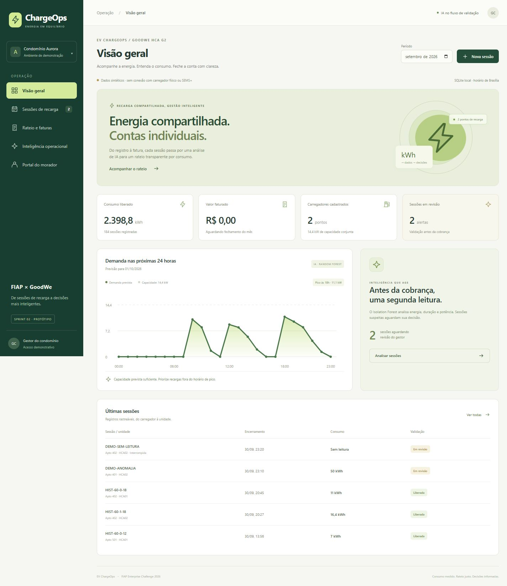
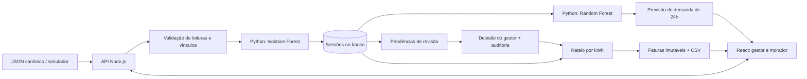

# EV ChargeOps — Sprint 02

Protótipo funcional do Enterprise Challenge FIAP × GoodWe 2026, desenvolvido a partir da [Sprint 01](../Challenge_GOODWE_sprint1/README.md). Equipe e integrantes: os mesmos registrados na Sprint 01.

O sistema transforma sessões de recarga em consumo individual, revisão de anomalias e faturas por unidade. A IA participa do fluxo: cada nova sessão é analisada antes de entrar no rateio, e a previsão horária apoia o planejamento da operação.

**Dados de demonstração são sintéticos. Não há conexão com o HCA G2 físico, SEMS+, RFID ou serviços de pagamento. O vídeo pitch não faz parte desta entrega.**



## Executar localmente

Requisitos: **Node.js 24 ou superior**, **Python 3.12** e acesso à internet apenas para instalar as dependências. Depois da instalação, aplicação e IA funcionam localmente.

Na pasta `Challenge_GOODWE_sprint2`, execute no PowerShell:

```powershell
python -m venv .venv
.\.venv\Scripts\python.exe -m pip install -r ai/requirements.txt
npx --yes pnpm@11.25.0 install --frozen-lockfile
npm start
```

Linux/macOS:

```bash
python3 -m venv .venv
.venv/bin/python -m pip install -r ai/requirements.txt
npx --yes pnpm@11.25.0 install --frozen-lockfile
npm start
```

Abra **<http://localhost:3000>**. O comando compila o React se necessário, inicia a IA em `127.0.0.1:8001`, cria o banco SQLite em `data/chargeops.sqlite` e carrega o cenário inicial somente quando o banco está vazio. `Ctrl+C` encerra os serviços. O ambiente virtual é detectado automaticamente; não é necessário ativá-lo.

Após alterar a interface, rode `npm run build` e reinicie. Opções de portas, banco e Python estão em `.env.example`; copie para `.env` se precisar alterar a configuração. Um `AI_URL` externo faz o iniciador usar esse serviço sem criar outro processo Python.

## Executar com PostgreSQL

Com Docker e Docker Compose instalados:

```bash
docker compose up --build
```

O Compose inicia PostgreSQL 17, o serviço Python e a API com React em <http://localhost:3000>. A aplicação espera os health checks antes de carregar os dados. O banco persiste no volume `chargeops_db`; PostgreSQL e IA ficam acessíveis somente na rede interna do Compose. A senha do exemplo serve apenas para este ambiente local.

**Validação desta entrega:** build, IA, API, persistência e navegação foram executados no modo SQLite. O caminho PostgreSQL/Compose foi implementado, mas não foi executado neste computador, que não tem Docker/PostgreSQL disponíveis.

## Roteiro de demonstração

1. Mantenha o mês **setembro/2026**. Há 184 sessões no mês, das quais duas aguardam revisão. O histórico completo tem 370 sessões entre agosto e setembro.
2. Abra **Inteligência operacional**. Confira a previsão de 24 horas, o erro de validação e os motivos de `DEMO-ANOMALIA` (50 kWh em 10 minutos) e `DEMO-SEM-LEITURA` (interrompida sem leitura válida).
3. Abra **Rateio e faturas** e clique em **Gerar faturas**. O servidor bloqueia o fechamento com HTTP 409 enquanto houver pendências.
4. Em **Sessões de recarga**, filtre **Em revisão**, clique em **Revisar** e exclua cada registro com justificativa de pelo menos 10 caracteres. Uma sessão sem leitura válida não pode ser aprovada. A decisão e o registro original ficam preservados.
5. Gere as faturas com tarifa **1,05** e taxa fixa **20,00**. A unidade **302**, com dois veículos, tem **35 + 25 = 60 kWh**, consumo de **R$ 63,00** e total de **R$ 83,00**. A recarga de 25 kWh foi interrompida e utiliza a última leitura válida.
6. Confira a unidade **999**: zero recargas, zero cobrança variável e R$ 20,00 de taxa fixa. Essa taxa é opcional, deve ser aprovada pelo condomínio e, quando configurada, aplica-se a todas as unidades cadastradas.
7. Exporte o CSV e abra **Portal do morador** para consultar histórico e fatura da unidade 302.

Para demonstrar ingestão, **antes do fechamento**, use **Nova sessão** ou importe `data/sample-sems-session.json` na tela de sessões. A importação de exemplo acrescenta 5,2 kWh à unidade 302 e altera seu total em relação ao roteiro acima. Identificadores duplicados e intervalos simultâneos no mesmo carregador são recusados. Cada importação aciona o modelo Python.

Fechar o mês é uma operação definitiva neste protótipo: faturas tornam-se imutáveis e novas sessões dessa competência são recusadas. Para recomeçar a demonstração sem apagar o banco atual, configure em `.env` um novo caminho, por exemplo `DB_PATH=data/nova-demo.sqlite`, e reinicie.

## O que foi implementado

| Entregável da Sprint 02 | Implementação | Evidência |
| --- | --- | --- |
| Registro de sessões e consumo individual | API REST, importação JSON, associação usuário → veículo → unidade, leituras em Wh, duração e competência | Formulário, tabela de sessões, testes de API |
| Modelo de rateio da Sprint 01 | Soma mensal dos veículos da unidade × tarifa + taxa fixa opcional; arredondamento em centavos | Apto 302 = 60 kWh / R$ 83,00; Apto 999 sem consumo |
| IA estrutural | Isolation Forest bloqueia sessões suspeitas; Random Forest prevê demanda horária com validação temporal | Tela de IA, respostas reais do serviço Python e testes |
| Evidências de funcionamento | Capturas de tela, execução HTTP registrada, CSV de faturas e saída dos testes | [Relatório de evidências](docs/EVIDENCIAS.md) |
| Decisões e desvios | Arquitetura, contratos, regras de competência e limitações documentadas | [Decisões técnicas](docs/DECISOES.md) |

## Arquitetura e fluxo



A API impede o faturamento enquanto houver qualquer sessão pendente no mês. Apenas sessões `clear` ou `approved` e com medição válida entram na soma. Rejeições não apagam registros. Falha do serviço de IA impede a ingestão, sem liberar uma sessão silenciosamente.

```text
Challenge_GOODWE_sprint2/
├── server/        API HTTP, normalização, banco, rateio e carga inicial
├── ai/            Modelos scikit-learn, serviço HTTP e testes Python
├── web/           Interface React responsiva
├── db/            Schema compartilhado entre SQLite e PostgreSQL
├── data/          Exemplo de importação; bancos locais ficam fora do Git
├── tests/         Testes de domínio e integração com IA real
├── scripts/       Inicialização, testes e geração de evidências
└── docs/          Decisões, contrato da API e evidências executadas
```

## IA: finalidade, entradas e limites

**Isolation Forest:** utiliza energia (kWh), duração (horas) e potência média (kW). Treina com pelo menos 30 sessões já validadas; remove os candidatos do conjunto de treino e usa `random_state=42`. Uma classificação anômala produz pendência, score e motivo. Sem histórico suficiente, exige revisão humana. Regras físicas complementares verificam limite de potência, ausência de leitura e medidor regressivo.

**Random Forest Regressor:** distribui a energia de cada sessão proporcionalmente ao tempo de sobreposição com cada hora, assumindo potência constante na sessão. Agrega a demanda conjunta e inclui horas vazias como zero. Usa hora e dia da semana com codificação cíclica, além do indicador de fim de semana. Requer 14 dias, usa janela máxima de 90 dias e separa os últimos 7 dias para medir MAE. Exibe também o erro de uma média histórica por dia da semana/hora. Em seguida, treina novamente com todo o histórico anterior ao dia previsto e retorna 24 estimativas e uma orientação operacional.

As métricas são de **dados sintéticos**, não validam o desempenho em uma instalação real. Nesta execução, o modelo teve MAE de **1,249 kW**, e a média histórica **1,243 kW**; portanto, não houve ganho sobre o baseline. A previsão é demonstrativa e consultiva. A IA não altera medições, preços ou comandos elétricos e não comprova economia nem segurança de uma instalação.

## Testes e reprodução das evidências

```bash
npm test
npm run build
npm run evidence
```

Foram executados **30 testes**, sendo 25 em Node.js e 5 em Python. Cobrem cálculo e arredondamento, interrupção, ausência/regressão de medidor, competência em Brasília, vínculos, sobreposição, duplicidade, concorrência, atomicidade, falha da IA, cold start, revisão, bloqueio e fechamento imutável, exportação e ausência de vazamento de dados futuros na previsão.

`npm run evidence` usa banco em memória isolado, executa o fluxo HTTP de ponta a ponta, verifica os valores esperados e grava `docs/evidence/execution.json` e `invoices.csv`. As capturas são de navegação real no navegador. Para abrir a execução faturada separadamente, use `node scripts/evidence.mjs --serve`, que a disponibiliza na porta 3001.

## Contrato e evolução

Consulte [API e dados](docs/API.md). O formato de importação é um **contrato interno canônico**, baseado nas variáveis da Sprint 01; não é apresentado como formato oficial da API GoodWe. Uma integração real exigirá credenciais, documentação autorizada e adaptação do payload.

Este é um protótipo acadêmico local. As próximas etapas incluem autenticação e autorização por perfil/unidade, cadastros administrativos pela interface, telemetria real, coleta SEMS+ homologada, treinamento com dados reais e validação regulatória por responsáveis técnicos. O seletor do portal do morador demonstra a experiência, sem representar controle de acesso.

Referências técnicas: [SQLite no Node.js](https://nodejs.org/api/sqlite.html), [Isolation Forest](https://scikit-learn.org/stable/modules/generated/sklearn.ensemble.IsolationForest.html), [Random Forest Regressor](https://scikit-learn.org/stable/modules/generated/sklearn.ensemble.RandomForestRegressor.html). As definições funcionais e o modelo de rateio vêm da documentação da Sprint 01.
