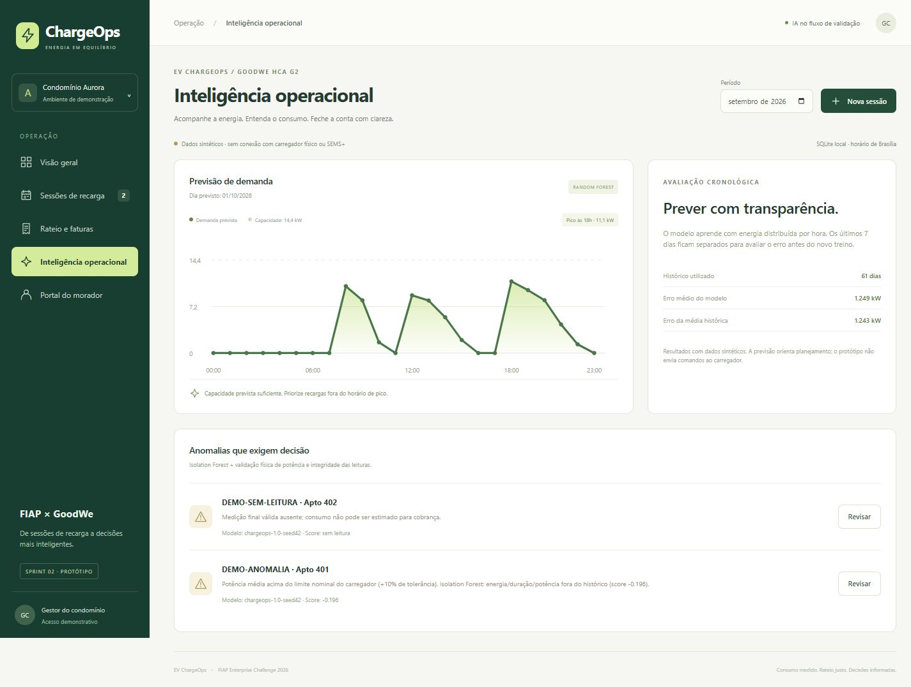
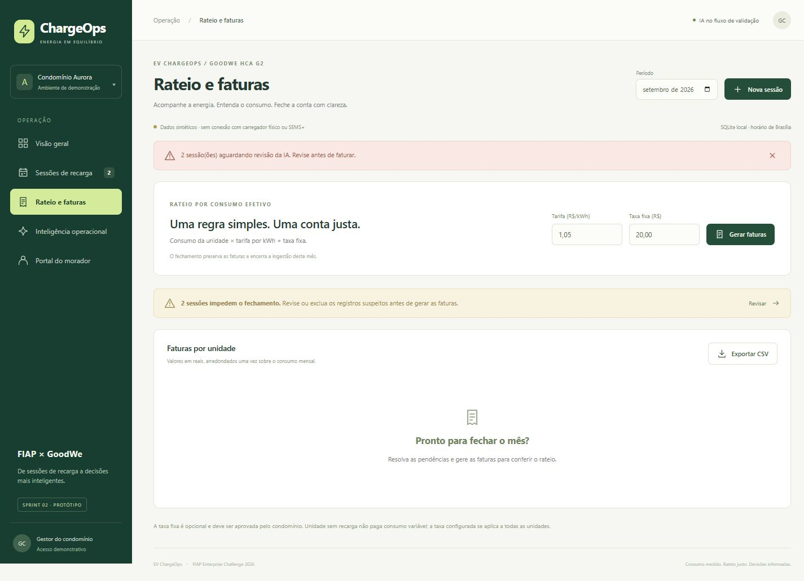
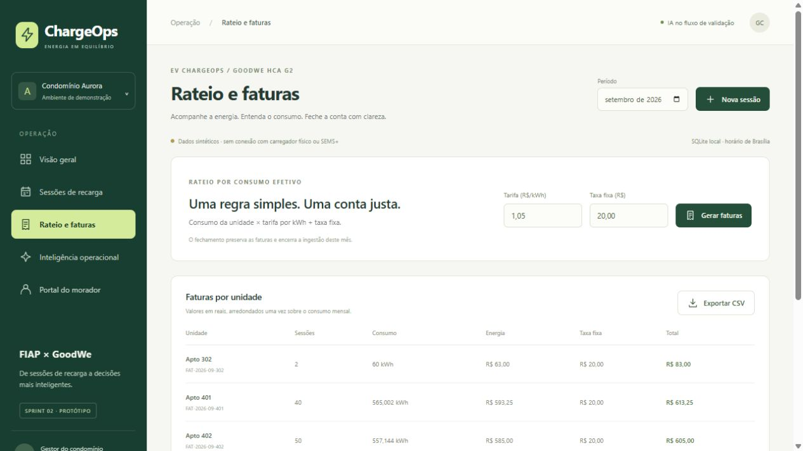
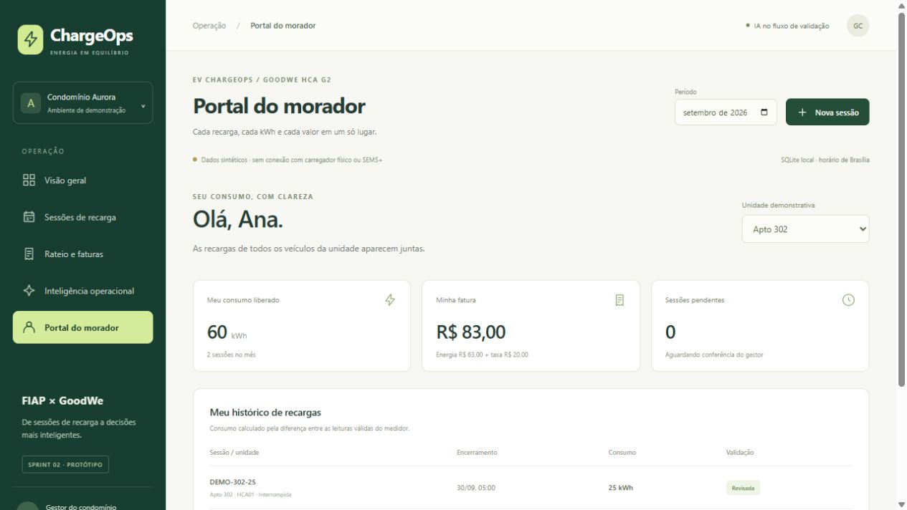
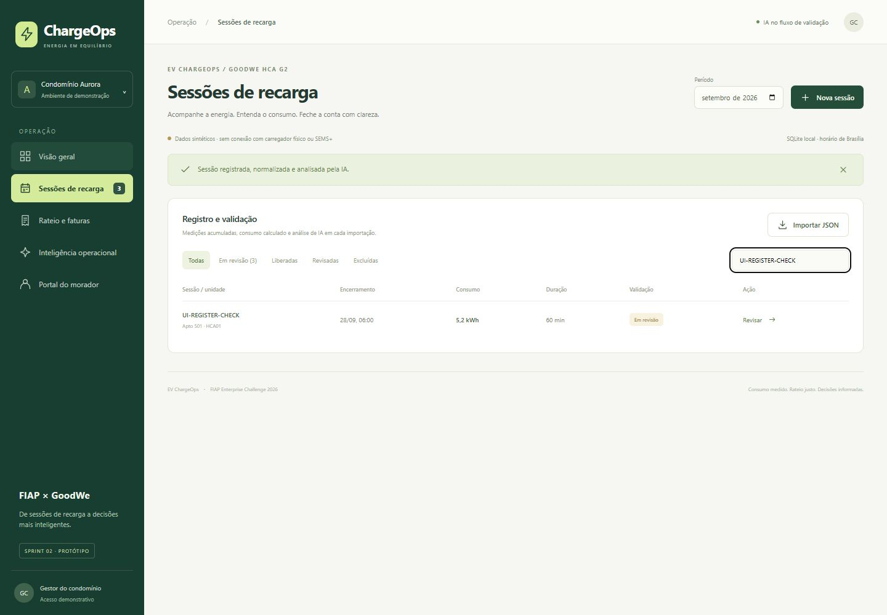
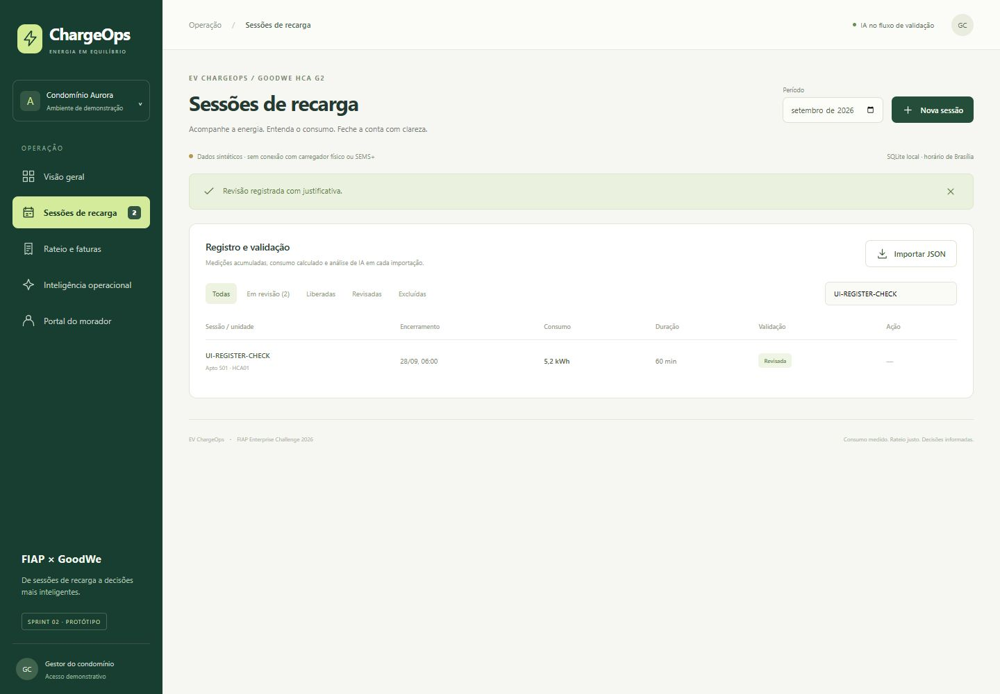
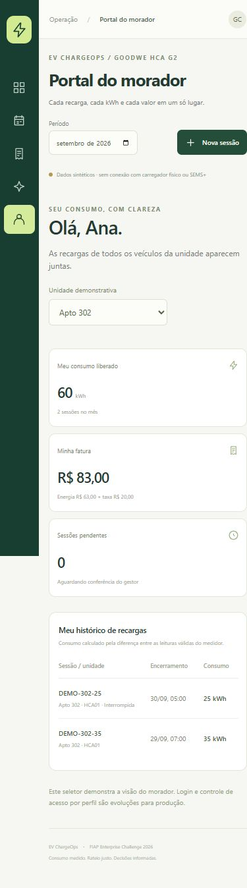

# Evidências de funcionamento — 09/10/2026

Esta entrega foi executada no Windows com Node.js 24.19.0, Python 3.12.14, scikit-learn 1.7.2 e SQLite. Dados de moradores, sessões e carregadores são sintéticos. As capturas abaixo são de uma aplicação React real consumindo a API Node e o serviço Python; não são mockups.

## Resultado verificado

| Verificação | Resultado |
| --- | --- |
| Build de produção React/Vite | Concluído |
| Testes Python | 5 aprovados |
| Testes Node.js, domínio e API com IA real | 25 aprovados |
| Persistência | 370 sessões reabertas por outro processo SQLite |
| Fluxo HTTP de evidência | Pendências → HTTP 409 → revisão justificada → fechamento → 6 faturas |
| Unidade 302, dois veículos | 60 kWh; R$ 63,00 de energia + R$ 20,00 de taxa = **R$ 83,00** |
| Unidade 999, sem sessões | 0 kWh; zero cobrança variável |
| Previsão de 01/10/2026 | 24 estimativas; pico às 18h, aproximadamente 11,1 kW |
| Avaliação temporal, últimos 7 dias | MAE do modelo 1,249 kW; baseline 1,243 kW |
| Navegação React | Registro, filtro, revisão com justificativa, bloqueio de fechamento, faturas e portal verificados |
| Interface móvel | Verificada em viewport de 390 × 844, sem transbordamento horizontal da página |
| PostgreSQL/Compose | Implementado; não executado neste ambiente |
| Carregador físico/SEMS+ | Sem acesso real; importação interna e simulação documentadas |

O Random Forest não superou a média histórica nesta execução. O resultado está exposto na interface e é uma limitação da demonstração com dados sintéticos. Não há alegação de acurácia real, ganho financeiro ou controle físico da carga.

## Registros reproduzíveis

- [Saída original dos 30 testes](evidence/tests.txt).
- [Requisições, respostas e verificações do fluxo completo](evidence/execution.json).
- [CSV das seis faturas geradas](evidence/invoices.csv).
- [Registro e auditoria do teste pela interface](evidence/ui-audit.json).

Execute `npm test` para repetir os testes e `npm run evidence` para reproduzir o fluxo HTTP em um banco isolado em memória. A geração verifica os resultados com assertions antes de gravar o JSON. As telas de faturas e morador abaixo usam esse cenário isolado, depois do fechamento; o banco local principal foi preservado com as duas pendências iniciais para permitir a demonstração interativa.

## Painel e IA

## Bloqueio de cobrança e faturas

O botão de gerar faturas foi acionado na interface antes da revisão e retornou o bloqueio abaixo. Após a exclusão justificada das duas sessões inconsistentes na execução isolada, seis faturas foram geradas.

## Registro e revisão pela interface

A sessão temporária `UI-REGISTER-CHECK` foi cadastrada pelo formulário com 5,2 kWh em 60 minutos, recebeu sinalização do Isolation Forest e foi aprovada com justificativa pelo gestor. Esse caso mostra que uma anomalia estatística pode exigir conferência mesmo quando a leitura é fisicamente plausível. O registro de teste foi retirado do banco de demonstração ao terminar a verificação; sua evidência e auditoria estão preservadas nos arquivos acima.

## Interface móvel

