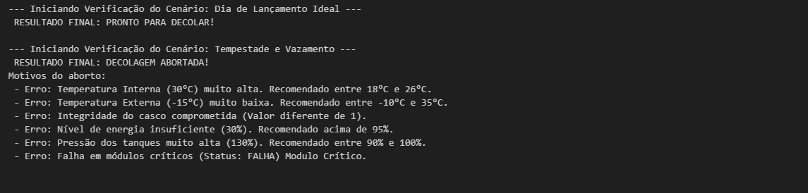

🚀 Simulador de Validação de Lançamento Espacial
📋 Explicação do Projeto
Este projeto foi desenvolvido como parte da atividade integradora da faculdade. O objetivo é simular um sistema de validação de telemetria para o lançamento de uma espaçonave. 

O script em Python recebe dados simulados de sensores (como temperatura interna e externa, integridade estrutural, níveis de energia e pressão dos tanques) e passa essas informações por um algoritmo de verificação. Baseado em faixas de segurança aeroespaciais predefinidas, o sistema decide autonomamente se o status final é "PRONTO PARA DECOLAR" ou "DECOLAGEM ABORTADA", listando os motivos em caso de falha.

---

📸 Prints da Execução
Abaixo estão as capturas de tela demonstrando o funcionamento do algoritmo com dois cenários distintos (um ideal e um com anomalias):

---

⚙️ Instruções de Execução do Código
Para rodar este simulador na sua máquina, siga os passos abaixo:

Pré-requisitos: Certifique-se de ter o Python instalado ou utilize um ambiente de notebooks (como Jupyter Notebook ou Google Colab).
Download: Faça o download do arquivo Decolagem.ipsynb deste repositório.
Abrindo o arquivo: - Se estiver usando o Google Colab: Acesse colab.research.google.com, vá em File > Upload notebook e selecione o arquivo baixado.
Se estiver usando o Jupyter local: Abra o terminal, digite jupyter notebook, navegue até a pasta onde o arquivo foi salvo e clique nele para abrir.
Execução: Com o notebook aberto, clique na célula de código que contém o script e pressione Shift + Enter (ou clique no botão "Run"/"Play" ao lado da célula).
Resultado: O output será gerado logo abaixo da célula, mostrando a análise dos dois cenários de teste configurados no código.